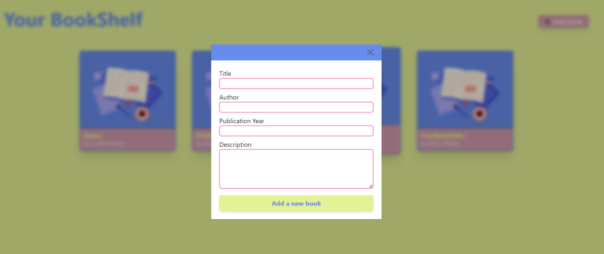
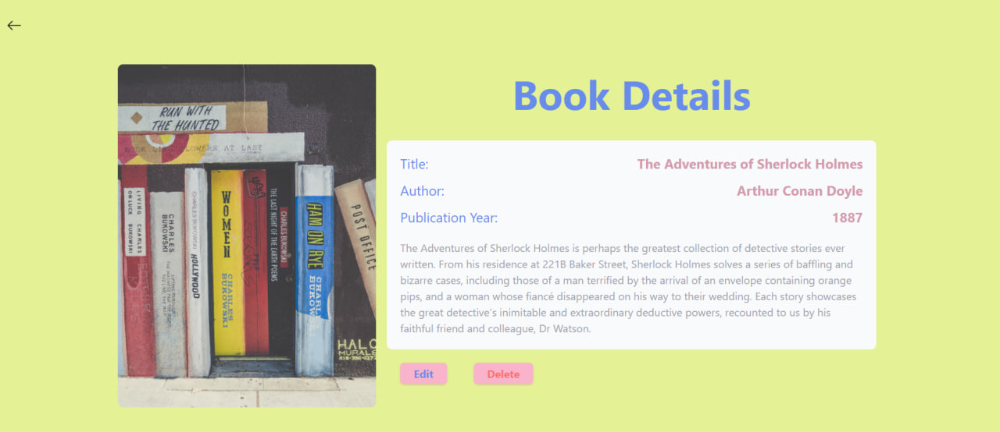
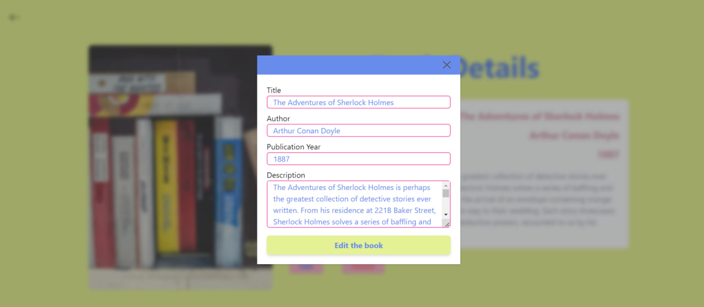

# The Bookshelf CRUD (Create, Read, Update, Delete) App

## Technologies Used

### Frontend
+ **Vite**
+ **React + TypeScript**
+ **Tailwind CSS:**
+ **Axios**
+ **React Router Dom**

### Backend
+ **NodeJS**
+ **MongoDB**
+ **Mongoose**


## Installation
 Clone the repository: 
 ```
 git clone https://github.com/sandrvvu/bookshelf-crud.git
 ```

Install dependencies
 
Run the frontend part: 
```
cd frontend
npm run dev
```

Run the development server: 
```
cd backend
npm run start
```

### Note 
You should create config.js file in the project backend folder:
```
const PORT = 5000;

const mongoDBURL = "";

module.exports = {
  PORT,
  mongoDBURL,
};
```

Replace empty string with your database info.

## Screenshots
+ Main

+ Create

+ Show

+ Edit



# Happy coding!ꨄꨄꨄ
